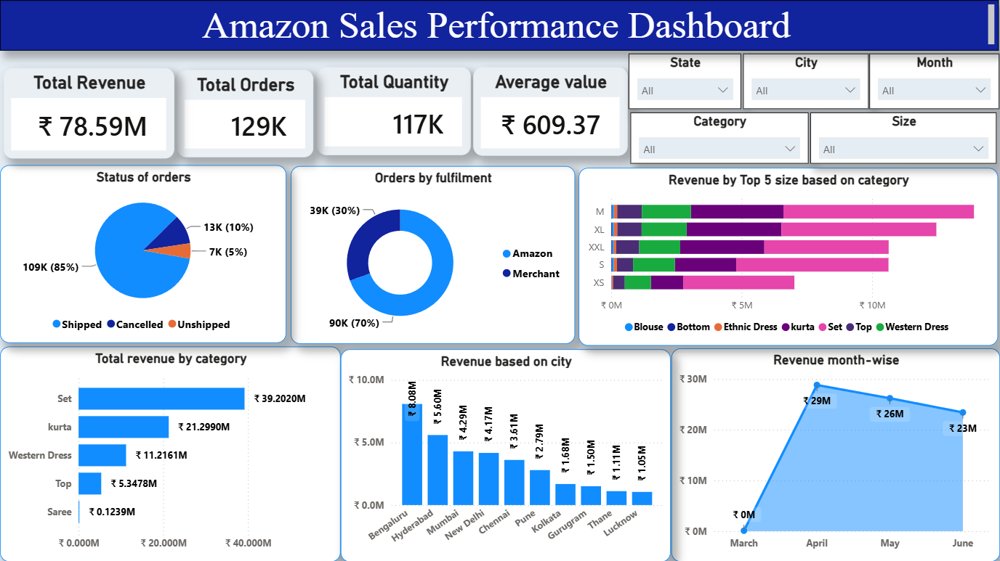

# 📊 Amazon Sales Performance Dashboard

## 📌 Project Overview

This project demonstrates an end-to-end Data Analytics workflow using **Excel, Python, PostgreSQL, SQL, and Power BI** to analyze Amazon sales data.

The objective of this project is to clean, analyze, and visualize sales data to identify business trends, product performance, city-wise revenue, fulfilment efficiency, and monthly sales trends through an interactive dashboard.

---

## 🎯 Objectives

- Clean and preprocess Amazon sales data using Python.
- Perform Exploratory Data Analysis (EDA).
- Analyze sales data using SQL queries in PostgreSQL.
- Build an interactive Power BI dashboard.
- Generate meaningful business insights for decision-making.

---

## 🛠️ Tools & Technologies

- Microsoft Excel
- Python
- Pandas
- NumPy
- Matplotlib
- Plotly
- PostgreSQL
- SQL
- Power BI

---

## 📂 Dataset

- Dataset: Amazon Sales Report
- Records: 128K+ sales records
- Type: E-commerce Sales Data

> **Note:** The original dataset is not included in this repository because of GitHub's file size limitations.

---

## 🔄 Project Workflow

```text
Raw Dataset
      ↓
Data Cleaning (Python)
      ↓
Exploratory Data Analysis (EDA)
      ↓
Database Creation (PostgreSQL)
      ↓
Business Analysis (SQL)
      ↓
Power BI Dashboard
      ↓
Business Insights
```

---

## 📊 Dashboard Preview

> Upload your dashboard screenshot to the **Images** folder and replace the line below.

```markdown

```

---

## 📈 Dashboard Features

### KPI Cards

- Total Revenue
- Total Orders
- Total Quantity
- Average Order Value

### Interactive Filters

- State
- City
- Category
- Month
- Size

### Visualizations

- Revenue by Category
- Revenue by City
- Revenue Trend
- Order Status Distribution
- Fulfilment Analysis
- Revenue by Size

---

## 🔍 Key Business Insights

- Total Revenue reached **₹78.59 Million**.
- More than **129K orders** were analyzed.
- **Set** category generated the highest revenue.
- **Bengaluru** generated the highest city revenue.
- Approximately **85%** of orders were successfully shipped.
- Amazon fulfilled nearly **70%** of all orders.
- Revenue peaked during **April**.

---

## 📁 Repository Structure

```
Amazon-Sales-Performance-Dashboard
│
├── Data
├── Python
├── SQL
├── Power BI
├── Image
└── README.md
```

---

## 🚀 Future Enhancements

- Customer Segmentation (RFM Analysis)
- Sales Forecasting using Machine Learning
- Profitability Analysis
- Customer Lifetime Value Analysis

---

## 👩‍💻 Author

**G. Janani**

M.Sc. Agricultural Statistics

Aspiring Data Analyst

GitHub: https://github.com/g-janani1312
